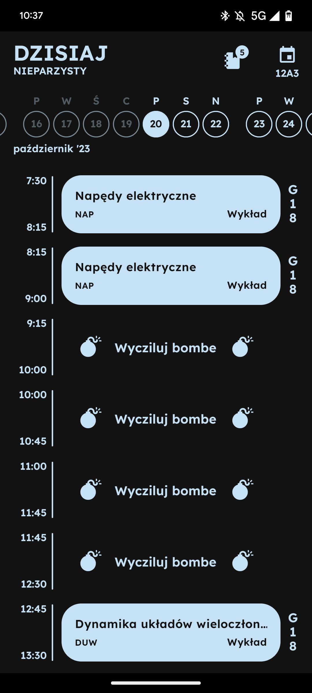
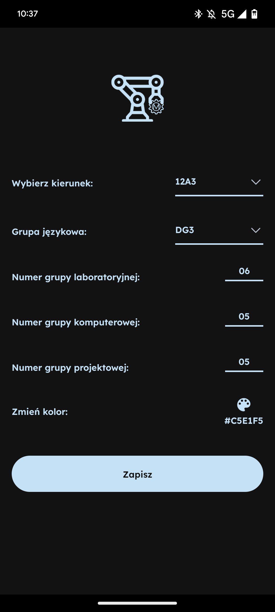
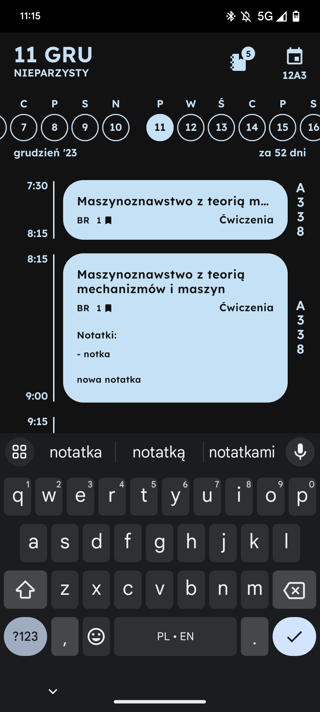
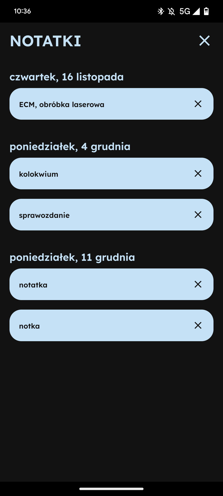
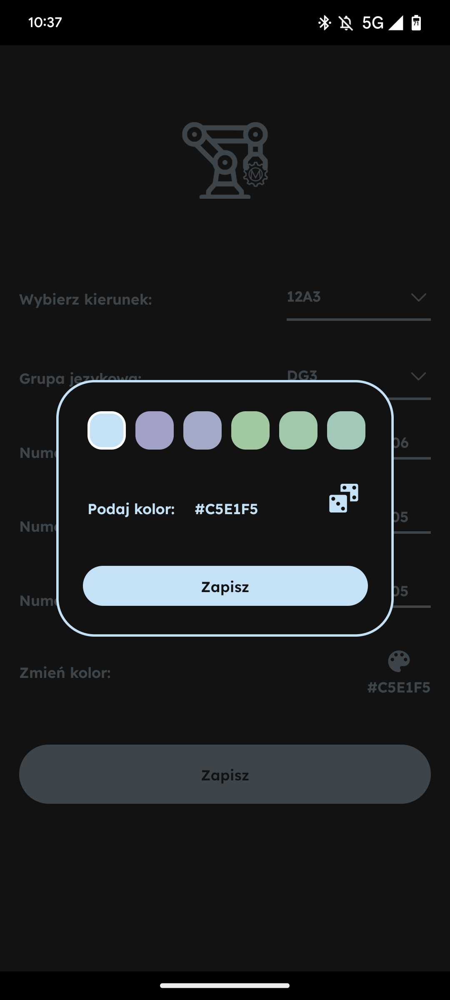

# Plan WM - Timetable App for Students at Cracow University of Technology's Faculty of Mechanical Engineering

Plan WM is a feature-rich mobile application designed to help students at the Faculty of Mechanical Engineering of the Cracow University of Technology manage their schedules efficiently. This app allows you to choose your timetable, add notes, and personalize the app's appearance.

## Features

- **Timetable Screen**: Offers a quick and easy view of your timetable.


- **Timetable Selection and Student Groups**: Choose your academic timetable and organize your schedule by adding student groups, making it convenient to track your academic commitments within the Faculty of Mechanical Engineering.


- **Note Management**: Add and store important notes related to your studies, timetable, or any other topic, keeping everything in one place.


- **Note Screen**: Access a dedicated note screen where you can view, edit, and organize all your notes effortlessly.


- **Customizable App Color**: Personalize the app's appearance by choosing a color theme that suits your style and preferences.


- **Data Persistence**: All your timetable data and notes are automatically saved to your device's storage using the AsyncStorage library, ensuring you don't lose your data.


## Releases

You can get the APK for Plan WM Beta below:

- [Plan WM Beta APK](https://drive.google.com/file/d/14TitxuKj4EFy4gIunoPOs5OZnGces6vh/view?usp=drivesdk)

Changelog for this release:

- Implemented a feature that lets users create and manage notes.
- Improved user interface for a more customizable experience.
- Fixed minor bugs and issues for enhanced stability.

<!--- Installation

[Include installation instructions here if applicable]

Usage

[Provide instructions on how students can use Plan WM]

Contributing

[If you want to encourage contributions, provide guidelines here]

License

[Specify the license you are using for your project]-->


# Development

## Step 1: Update required npm packages

First, you will have to download/update **npm packages** _required_ by the project.

To download/update the packages run the following command from the _root_ of the project:

```bash
yarn
```

## Step 2: Start the Metro Server

Now, you will need to start **Metro**, the JavaScript _bundler_ that ships _with_ React Native.

To start Metro, run the following command from the _root_ of the project:

```bash
yarn start
```

## Step 3: Start your Application

Let Metro Bundler run in its _own_ terminal. Open a _new_ terminal from the _root_ of your React Native project. 

Run the following command to start your _Android_ or _iOS_ app:

### For Android

```bash
yarn android
``` 
or just click **a** in the metro terminal

### For iOS

```bash
yarn ios
```
or just click **i** in the metro terminal

# Learn More

To learn more about React Native, take a look at the following resources:

- [React Native Website](https://reactnative.dev) - learn more about React Native.
- [Getting Started](https://reactnative.dev/docs/environment-setup) - an **overview** of React Native and how setup your environment.
- [Learn the Basics](https://reactnative.dev/docs/getting-started) - a **guided tour** of the React Native **basics**.
- [Blog](https://reactnative.dev/blog) - read the latest official React Native **Blog** posts.
- [`@facebook/react-native`](https://github.com/facebook/react-native) - the Open Source; GitHub **repository** for React Native.
